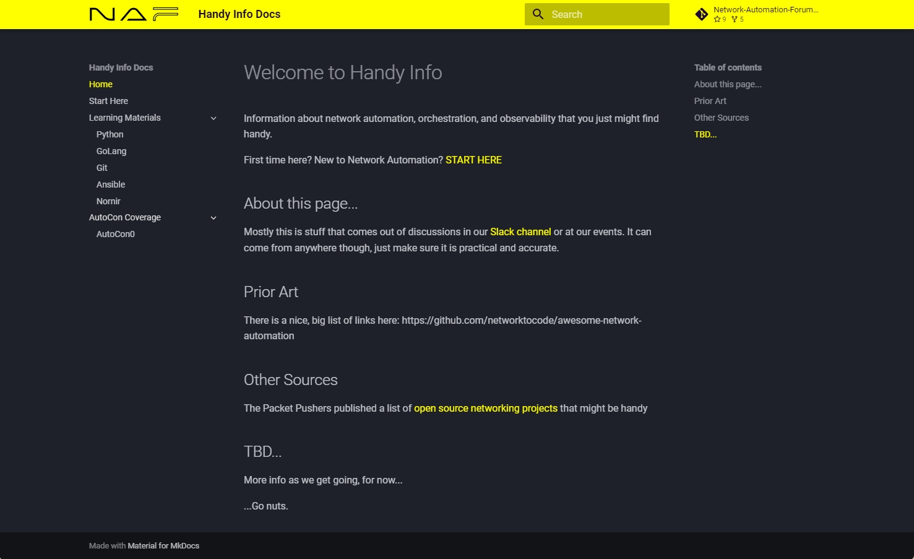

# Handy Info
Information about network automation, orchestration, and observability that you just might find handy.

First time here? New to Network Automation? [START HERE](docs/StartHere.md)

## About this repo...

Mostly this is stuff that comes out of discussions in our [Slack channel](https://join.slack.com/t/networkautoma-prb3593/shared_invite/zt-25rdfdmyf-qYoYgXEEMs7h_aqwC79Abg) or at our events. It can come from anywhere though, just make sure it is practical and accurate.

Markdown formatting.

We'll probably need to add a directory structure at some point. For now we'll keep it flat and revisit after we know what kind of stuff actually shows up...

Go nuts.

## Prior Art

There is a nice, big list of links here: https://github.com/networktocode/awesome-network-automation

## Other Sources

The Packet Pushers published a list of [open source networking projects](https://packetpushers.net/blog/open-source-networking-projects/) that might be handy


## Easily Spin Up the Docs Locally

In order to quickly run mkdocs locally.

1. Make sure you have poetry [installed](https://python-poetry.org/docs/#installation).

2. Enable the poetry shell.

From the root of the project run `poetry shell`.

```
▶ poetry shell
Creating virtualenv handyinfo-9ndDauHc-py3.10 in /home/naf/.cache/pypoetry/virtualenvs
Spawning shell within /home/naf/.cache/pypoetry/virtualenvs/handyinfo-9ndDauHc-py3.10

user@dev-vmware:/open_source/handyinfo  jkala-initial-cleanups ✗                                                                                                                 
▶ emulate bash -c '. /home/naf/.cache/pypoetry/virtualenvs/handyinfo-9ndDauHc-py3.10/bin/activate'
(handyinfo-py3.10) 
user@dev-vmware:/open_source/handyinfo  jkala-initial-cleanups ✗ 
```

Poetry shell spins up a python virtual environment and sources it.

3. Install the Python Development Dependencies.

This is a documentation repo so their is no `main` dependencies, just `development` dependencies.

Run `poetry install --only dev` to install the development dependencies into the poetry virtualenv.

```
▶ poetry install --only dev                                                                                  
Using version ^1.5.3 for mkdocs

Updating dependencies
Resolving dependencies... (0.4s)

Writing lock file

Package operations: 15 installs, 1 update, 0 removals

  • Installing six (1.16.0)
  • Installing markupsafe (2.1.3)
  • Installing python-dateutil (2.8.2)
  • Installing pyyaml (6.0.1)
  • Updating click (4.1 -> 8.1.7)
  • Installing ghp-import (2.1.0)
  • Installing jinja2 (3.1.2)
  • Installing markdown (3.5.1)
  • Installing mergedeep (1.3.4)
  • Installing packaging (23.2)
  • Installing pathspec (0.12.1)
  • Installing platformdirs (4.1.0)
  • Installing pyyaml-env-tag (0.1)
  • Installing watchdog (3.0.0)
  • Installing mkdocs (1.5.3)
  • Installing yamllint (1.33.0)
```

4. Run Docs via Poetry

Can bring up the local rendered site by running `poetry run mkdocs serve` from the root of the repo.

```
user@dev-vmware:/open_source/handyinfo  jkala-initial-cleanups ✗
▶ poetry run mkdocs serve
INFO    -  Building documentation...
INFO    -  Cleaning site directory
INFO    -  Documentation built in 0.44 seconds
INFO    -  [11:10:15] Watching paths for changes: 'docs', 'mkdocs.yml'
INFO    -  [11:10:15] Serving on http://127.0.0.1:8000/
```

This is a development server and will reload automatically so you can see your changes live.

### Screenshots


